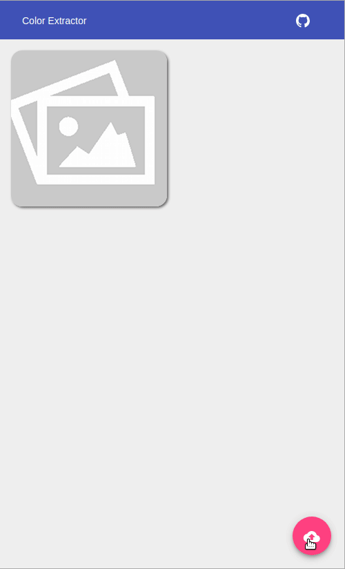

# ColorExtractor

Extracts main colors from a picture to get a graphic chart.
  You can download a CSS file from it.

This project was generated with [Angular CLI](https://github.com/angular/angular-cli) version 6.0.8.

## Live Example

## Development server

Run `ng serve` for a dev server. Navigate to `http://localhost:4200/`. The app will automatically reload if you change any of the source files.

## Build

Run `ng build` to build the project. The build artifacts will be stored in the `dist/` directory. Use the `--prod` flag for a production build.

## Running unit tests

Run `ng test` to execute the unit tests via [Karma](https://karma-runner.github.io).

## Running end-to-end tests

Run `ng e2e` to execute the end-to-end tests via [Protractor](http://www.protractortest.org/).

## Contributing
- [Cyril Ichti](https://github.com/seeren)

## Authors

* **Sébastien Lorrain** - *Initial work* - [color-extractor](https://github.com/sldevand/color-extractor)

## License

This project is licensed under the MIT License - see the [LICENSE.md](LICENSE.md) file for details.

